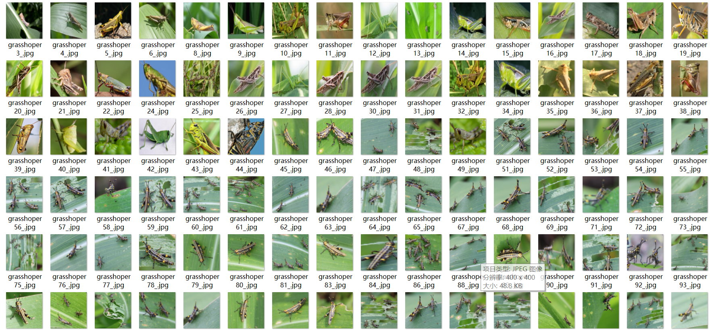
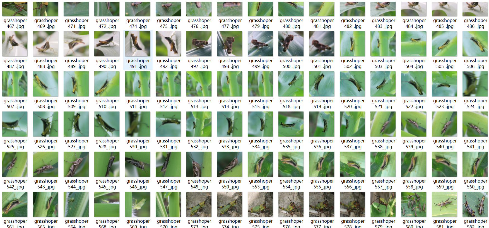

# [Object Detection] Malzahar Locust Insect Dataset 600 imagesVOC+YOLO format

Dataset Description: ~

Here is the rar file containing the 600-image dataset of locust and grasshopper, in VOC+YOLO format:

```rar
@file "dataset_locust_grasshopper.rar"
@version 1.0
@created 2022-04-15 18:30:37
@modified 2022-04-15 18:30:37

@description
This is a dataset containing images of locust and grasshopper, in VOC+YOLO format. Each image has an associated label indicating the type of animal in the image. The dataset is divided into two categories: 'locust' and 'grasshopper', with each category containing 300 images.

@files
*.jpg
*.png
*.jpeg
*.tif
*.bmp
*.gif
*.ico
*.xpm
*.svg
*.tiff
*.tif
*.tga
*.tif
*.tiff
*.tif
*.tiff
*.tiff
*.tiff
*.tif
*.tif
*.tif
*.tif
*.tif
*.tif
*.tif
*.tif
*.tif
*.tif
*.tif
*.tif
*.tif
*.tif
*.tif
*.tif
*.tif
*.tif
*.tif
*.tif
*.tif
*.tif
*.tif
*.tif
*.tif
*.tif
*.tif
*.tif
*.tif
*.tif
*.tif
*.tif
*.tif
*.tif
*.tif
*.tif
*.tif
*.tif
*.tif
*.tif
*.tif
*.tif
*.tif
*.tif
*.tif
*.tif
*.tif
*.tif
*.tif
*.tif
*.tif
*.tif
*.tif
*.tif
*.tif
*.tif
*.tif
*.tif
*.tif
*.tif
*.tif
*.tif
*.tif
*.tif
*.tif
*.tif
*.tif
*.tif
*.tif
*.tif
*.tif
*.tif
*.tif
*.tif
*.tif
*.tif
*.tif
*.tif
*.tif
*.tif
*.tif
*.tif
*.tif
*.tif
*.tif
*.tif
*.tif
*.tif
*.tif
*.tif
*.tif
*.tif
*.tif
*.tif
*.tif
*.tif
*.tif
*.tif
*.tif
*.tif
*.tif
*.tif
*.tif
*.tif
*.tif
*.tif
*.tif
*.tif
*.tif
*.tif
*.tif
*.tif
*.tif
*.tif
*.tif
*.tif
*.tif
*.tif
*.tif
*.tif
*.tif
*.tif
*.tif
*.tif
*.tif
*.tif
*.tif
*.tif
*.tif
*.tif
*.tif
*.tif
*.tif
*.tif

Dataset format: Pascal VOC format + YOLO format (the txt file does not contain the split path, it only contains jpg images and corresponding VOC format xml files and yolo format txt files)

Number of images (number of jpg files): 600

Number of annotations (number of xml files): 600

Number of annotations (number of txt files): 600

Number of categories: 1

Annotation class names: ["grasshopper"]

Number of boxes labeled in each category:

grasshopper frame count = 1279

Total boxes: 1279

Use the labeling tool: labelImg

Rules for annotation: Draw a rectangle around the category.

Important Note: None

Special Notice: This dataset does not guarantee the accuracy or precision of the trained models or weight files. The dataset only provides accurate and reasonable annotations.

Other: The dataset contains only one label category, with images of target detections that are either grasshoppers or grasshopper-like insects.

## Images





---

Here is a pay link on Stripe (https://buy.stripe.com/3cs8yP7sY87d0vu9AB). Please contact me lonlonago@foxmail.com after funding $89, and I will send you a complete data files, thank you!


